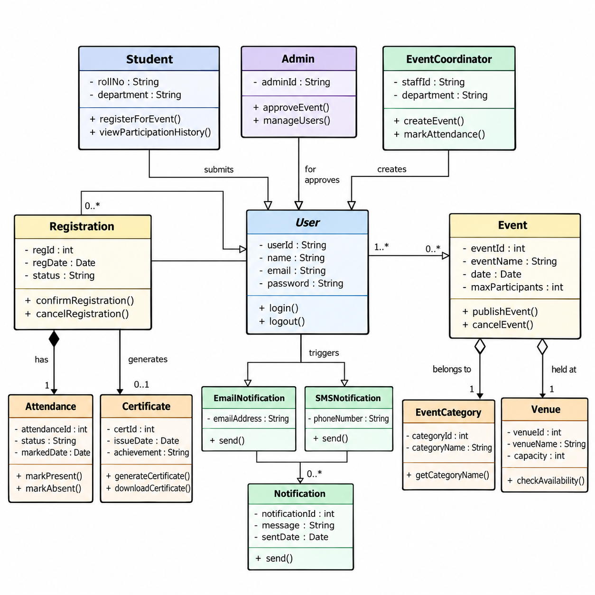

> **Darshan Bagade - Roll No . 44**
# Practical No. 5 — UML Class Diagram

**Course:** LAB: Software Engineering (23CT1704)
**Case Study:** Extra-Curricular Event Tracking System (ECETS)

## Aim
To study and draw UML Class diagram for Extra-Curricular Event Tracking System.

## Case Study
Students register for events published by event coordinators. Attendance is
tracked for each registration, and certificates and notifications are
generated once an event concludes. Admins approve published events and
manage user accounts.

## Classes Identified (13)

| Class | Responsibility |
|---|---|
| `User` *(abstract)* | Common identity and login details of every user of the system |
| `Student` | Registers for events, views participation history and downloads certificates |
| `EventCoordinator` | Creates and manages events and marks attendance |
| `Admin` | Approves published events and manages user accounts |
| `Event` | An extra-curricular activity with a name, date, venue and category |
| `Registration` | Links a student to an event; tracks registration status |
| `Attendance` | Attendance record for one registration, marked present or absent |
| `Certificate` | Digital certificate generated for a completed registration |
| `Notification` *(abstract)* | Common message sent to a user regarding an event |
| `EmailNotification` / `SMSNotification` | Specialised notifications sent by e-mail or SMS |
| `EventCategory` | Classification of an event (cultural, sports, technical, etc.) |
| `Venue` | Location where an event is held, with capacity |

## Relationships Used

| Classes | Relationship | Multiplicity |
|---|---|---|
| User – Admin, Student, EventCoordinator | Generalization | – |
| Notification – EmailNotification, SMSNotification | Generalization | – |
| Student – Registration | Association (submits) | 1 to 0..* |
| EventCoordinator – Event | Association (creates) | 1 to 0..* |
| Admin – Event | Association (approves) | 1 to 0..* |
| Registration – Event | Association (for) | * to 1 |
| Registration – Attendance | Composition (has) | 1 to 1 |
| Registration – Certificate | Association (generates) | 1 to 0..1 |
| Event – Notification | Association (triggers) | 1 to 0..* |
| Event – EventCategory | Association (belongs to) | * to 1 |
| Event – Venue | Aggregation (held at) | * to 1 |

## Diagram

*Fig 5.1: UML Class Diagram - Extra-Curricular Event Tracking System*

## Outcome
Studied the concepts of UML Class Diagrams and drew an appropriate Class
Diagram for the Extra-Curricular Event Tracking System, identifying thirteen
classes with their attributes and operations and the generalization,
association, aggregation and composition relationships among them.
